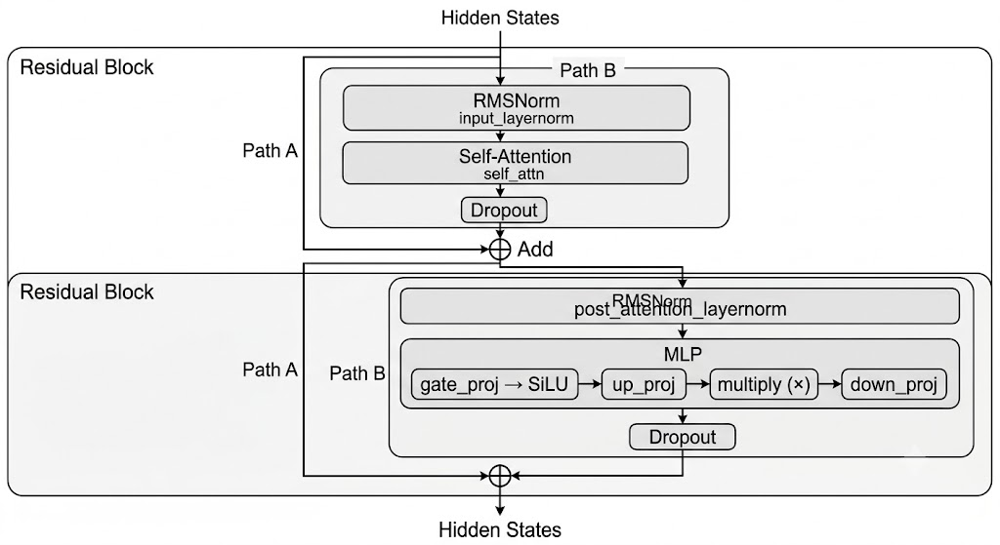

## Emu3DecoderLayer

1. Self-Attention：
$$ Attention(Q, K, V) = SoftMax(\frac{QK^T}{\sqrt{d^k}})V $$

2. Emu3MLP: 其实是SwishGLU（Swish gate linear unit），包含三部分，gate linear，up linear，和down linear。
$$ FFN_{SwiGLU}(x) = (Swish(xW_1) \otimes xW_2)W_3$$
> *其中Swish是SiLU激活函数。

3. Emu3RMSNorm
- 核心思想： **RMSNorm** (Root Mean Square Normalization) 是对传统 LayerNorm 的简化，去除了均值中心化步骤，只保留方差归一化。

### ActionLayer
ActionLayer 是对 Emu3DecoderLayer 的叠加。